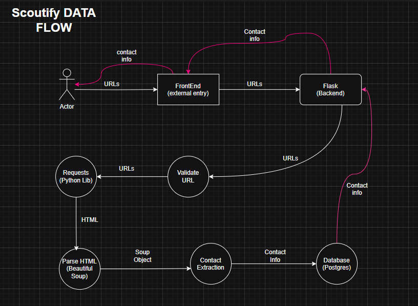

# System Design

## What are the major components Scoutify needs?

1. User
    Actual users who access the application
2. Frontend
    HTML/CSS/JS
3. Flask Backend
4. Authentication
    Using Flask Sessions
    argon encryption
5. URL validation
6. Scraper
    Beautiful Soup, Requests
7. Contact extraction
8. Database
    Postgres SQL
9. Frontend(returned data)
10. User

## Responsibility

- FRONTEND
    - Used for making the user access the scaper through Usable, decent and easy to use UI
- Flask
    - Used to send , receive HTTP REST api requests and handle backend logics and make use of python librarys and function calls to return
    valid processed output to the client
- Authentication
    - Used for Authenticating user's identity. Includes Login/Logout/SignUp
- URL Validation
    - URL validation component is used to Validate whether the given URL is valid or not
- Scraper and Contact Extraction
    - Scraper component is used to Scrape Business Contact information from the Given Website URL's
- Database
    - Used to store user's personal information
    - Used to store user's generated scrape data

## DATAFLOW

